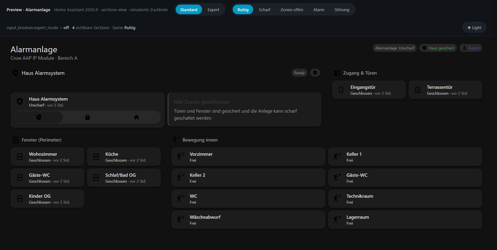
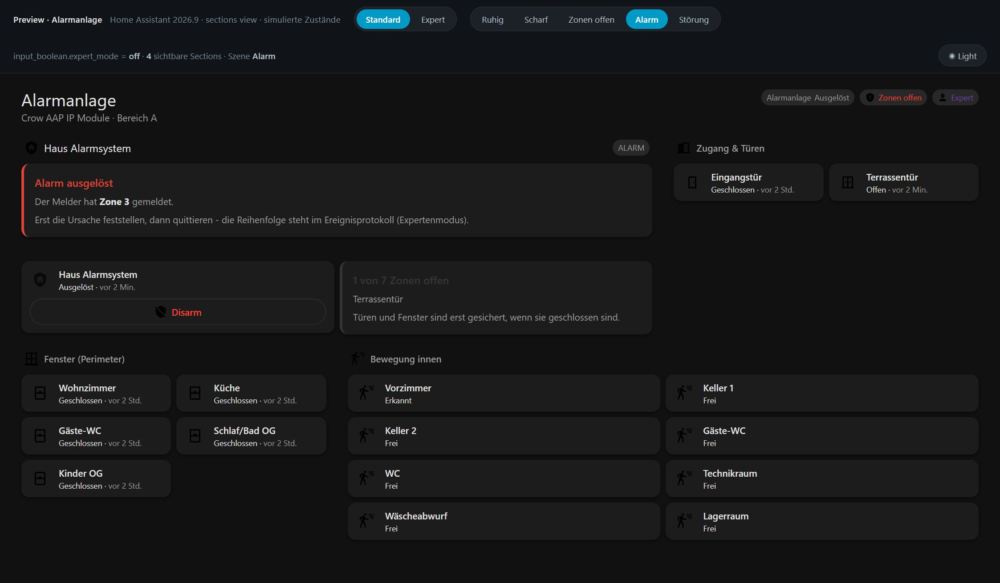
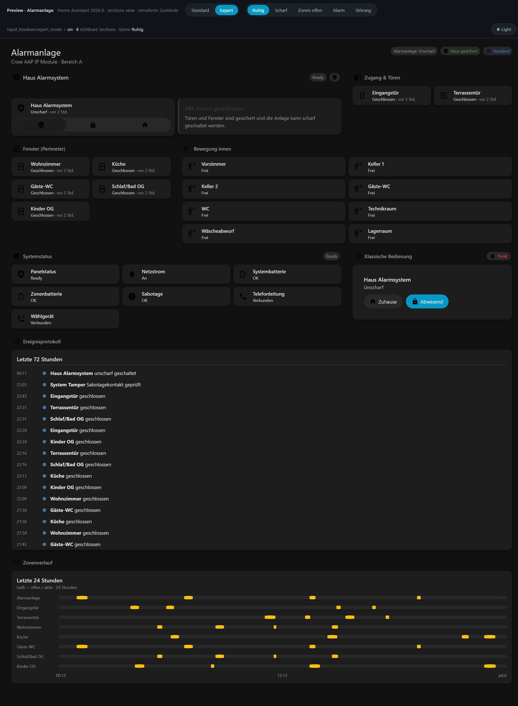

# Dashboard

A ready-to-use Lovelace dashboard for the `crowipmodule` integration, built for
**Home Assistant 2026.9** (`sections` view).

Two dashboards in one file, switched with a helper you already have:

| | |
| --- | --- |
| **Standard** (`input_boolean.expert_mode = off`) | arming, the state of the house, doors, windows, motion - 4 sections |
| **Expert** (`input_boolean.expert_mode = on`) | everything above **plus** panel diagnostics, the classic keypad with the panic trigger, a 72 h event log and a 24 h zone history - 8 sections |

The expert sections are added below the standard ones, never instead of them.

| Standard | Alarm |
| --- | --- |
|  |  |



## Files

| File | Purpose |
| --- | --- |
| `alarm-dashboard.yaml` | the dashboard - paste this into the dashboard |
| `preview/index.html` | offline preview of the dashboard - open it in a browser, no Home Assistant needed |
| `preview/build_cards.py` | regenerates `preview/cards.js` from `alarm-dashboard.yaml` |
| `preview/fetch_icons.py` | regenerates `preview/icons.js` (Material Design Icons used by the preview) |
| `preview/dashboard.js` | the preview renderer, including the small Jinja subset the markdown cards use |

## Requirements

* Home Assistant **2026.9** or newer - the dashboard uses the `sections` view,
  section `visibility`, tile `state_content`, the `alarm-modes` tile feature and
  heading badges.
* The `crowipmodule` integration (this repository).
* **One** helper, `input_boolean.expert_mode`. No packages, no template sensors,
  no custom cards, no `card_mod`, no theme. Every summary on the dashboard is
  computed by the cards themselves: conditional cards for the alarm banners,
  Jinja inside the markdown cards for the details.

If the helper does not exist yet, add it to `configuration.yaml` and restart:

```yaml
input_boolean:
  expert_mode:
    name: Alarm Expertenmodus
    icon: mdi:account-hard-hat
```

## Install

**Option A - UI (recommended)**

1. Settings > Dashboards > *Add dashboard* > *New dashboard from scratch*,
   title e.g. `Alarmanlage`, create.
2. Open it > pencil icon > three dots > **Raw configuration editor**.
3. Replace the whole content with `alarm-dashboard.yaml` > *Save*.

**Option B - YAML mode**

1. Save the file as `<config>/lovelace/alarm.yaml`.
2. Register it in `configuration.yaml`:

   ```yaml
   lovelace:
     dashboards:
       alarm:
         mode: yaml
         title: Alarmanlage
         icon: mdi:shield-lock
         show_in_sidebar: true
         filename: lovelace/alarm.yaml
   ```

3. In YAML mode the view has to be nested under a `views:` key:

   ```yaml
   views:
     - <this file from "type: sections" downwards>
   ```

## Entity ids

The dashboard addresses the entities of the integration. Renaming an entity in
the UI does not change its entity id, but if you renamed it in the entity
settings, adjust the ids in `alarm-dashboard.yaml`.

The layout assumes the **upgraded** naming where the device is
`Crow Alarm System`, i.e. `binary_sensor.crow_alarm_doors_*`,
`binary_sensor.crow_alarm_windows_*` and `binary_sensor.crow_alarm_system_*`.
The alarm panel itself is `alarm_control_panel.security_crow_alarm_system_a`.

The motion detectors (`binary_sensor.bewegungsmelder_*`) are treated as
**informational** interior detectors, not as perimeter zones: they are amber,
never red, and they are not part of the "zones open" count. If they are Crow
zones on your panel, add them to the `expand(...)` list in the hero panel - and
to the perimeter condition if they should block arming.

## What this replaces

The dashboard this file replaces worked, but it had a few things worth fixing.
All of them were checked against the real Home Assistant 2026.9 frontend, not
guessed:

| In the old dashboard | Why it was wrong | Here |
| --- | --- | --- |
| `secondary_info: last-updated` on 20 tiles | The tile card has **no** `secondary_info` option - that is an entities/glance option. Unknown keys are silently ignored, so no tile ever showed a time. | `state_content: [state, last_changed]`, which the tile card does support |
| `states: [arm_home, arm_away, arm_custom_bypass]` on the alarm panel card | This integration reports `ARM_HOME \| ARM_AWAY \| TRIGGER` only. An unsupported entry in `states:` renders no button at all. | `states:` omitted - Home Assistant renders the supported modes itself |
| Every zone tile with `color: red` | Works, but for the wrong reason: `color` is the colour **while active**, and Home Assistant defines no state colour for the `door`/`window`/`motion` device classes, so they would otherwise fall back to **amber**. Red was doing real work - it just was not obvious. | Red for the perimeter, **amber for motion** - so a perimeter breach and somebody walking through the house no longer look the same |
| `binary_sensor.alles_geschlossen` badge with `color: green` + `show_state` | A binary sensor without a device class renders its state as "Ein"/"Aus". Green also only signals "on" - when a zone opens, the badge just goes grey. | Two mutually exclusive badges, "Haus gesichert" (green) and "Zonen offen" (red) - readable whatever device class the helper has |
| No urgency anywhere | `triggered`, `arming` and "a zone is open while disarmed" all looked exactly like a quiet house. | Conditional banners: alarm (red, names the zone from the `alarm_zone` attribute), panel fault (red, names every fault), exit delay (orange) |
| 20 tiles, no summary | You had to read every tile to know whether the house was secured. | A zone panel in the hero that counts and names the open zones, and says "Alle Zonen geschlossen" when there is nothing to see |
| Panel diagnostics mixed into the standard view | `sensor.crow_system_status` and the six system binary sensors are `EntityCategory.DIAGNOSTIC` in the integration. | Compressed into one fault banner in the standard view, full tiles in the expert view |
| `sensor.crow_alarm_system_system_tamper` filed under "Fenster (Perimeter)" | A tamper contact is a system-integrity signal, not a window. | Moved to the diagnostics section, and it raises the fault banner |
| Everything visible at once | | Expert sections behind `input_boolean.expert_mode` |
| No history | Nothing showed what happened while you were away. | Event log (72 h) and zone history (24 h) in the expert view |
| No panic access | | A "Panik" button in the expert section, guarded by a confirmation |

### Two things to know about the control

* **The code prompt.** The integration always reports `code_format`, so Home
  Assistant asks for the code whenever the tile's `alarm-modes` feature disarms -
  even when the code is stored in the integration. To arm and disarm without a
  prompt, give the alarm entity a *default code*: **Settings > Devices &
  services > Entities > the alarm entity > gear icon > Default code**. The
  classic `alarm-panel` card, which has a keypad, stays available in the expert
  section.
* **`modes:` is an allow-list.** Listing `modes: [armed_home, armed_away]` on the
  feature would *remove* the Disarm entry and leave the tile unable to disarm.
  The dashboard therefore omits `modes:` and gets Disarm / Arm Away / Arm Home.
  While the panel is arming or triggered, the feature deliberately collapses to a
  single Disarm button, and the tile pulses.

## Preview

`preview/index.html` renders the very same card tree with a fake `hass` object,
Home Assistant's real theme tokens and its real card semantics: visibility rules
on cards and sections, the tile colour logic, the code-free `alarm-modes`
behaviour, and the Jinja in the markdown cards (a small subset: ``,
``, `{{ }}`, `expand()`, `is_state()`, `state_attr()` and the filters
`selectattr` / `map` / `join` / `length`).

`preview/cards.js` is generated from `alarm-dashboard.yaml`, so the preview
cannot show a card tree the YAML does not have. After editing the YAML:

```bash
python dashboards/preview/build_cards.py    # YAML -> cards.js
python dashboards/preview/fetch_icons.py    # refresh the vendored MDI icons
python -m http.server 8777 --bind 127.0.0.1 # then open http://127.0.0.1:8777/
```

The toolbar with the Standard/Expert switch, the scenario buttons and the
light/dark toggle is part of the preview, not of the dashboard. The scenario
buttons are different states of the house (quiet, armed, zones open, alarm,
fault) so the banners can be reviewed without waiting for the panel to do it.

What the preview approximates: the cards themselves (tile, heading, logbook,
history-graph, alarm-panel) are hand-built stand-ins with the Home Assistant
look, and the logbook entries and the 24 h history are generated, not recorded.

## Known limits

* `sensor.crow_system_status` returns the integration's own English strings
  (`Ready`, `Armed Away`, `ALARM`, `Power Failure`, ...). The dashboard shows
  them as they are.
* Bypassing a zone is **not** possible from Home Assistant. The driver parses
  the panel's `ZBY` / `ZBYR` messages and the zone attributes carry `bypass`,
  but there is no service, button or entity action that sets it - so the
  dashboard does not offer one.
