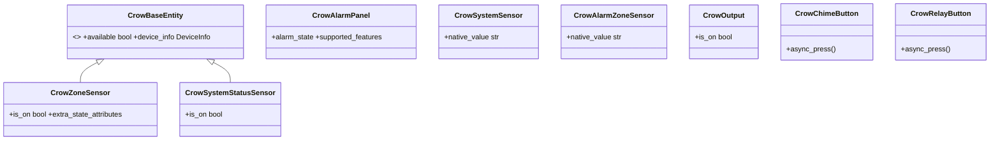
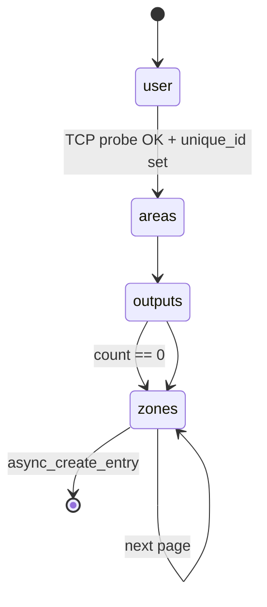

# Software Design Document (SDD)

**Project:** Crow/AAP Alarm IP Module for Home Assistant
**Integration domain:** `crowipmodule`
**Branch:** `HA2026_09_dev` · **Version:** `2.1.0-beta.1` · **Status:** pre-release
**Last updated:** 2026-09-21

This document specifies **how** the integration is built: modules, signatures, data shapes,
protocol tables and per-entity contracts. Read the [ADD](ADD.md) first for the architectural
rationale; the diagrams live in [WORKFLOWS.md](WORKFLOWS.md).

---

## 1. Module inventory

| Module | Responsibility | Depends on |
|---|---|---|
| `__init__.py` | Entry setup/teardown, callback marshalling, hub device registration | `const`, `device`, `pycrowipmodule`, `homeassistant.*` |
| `device.py` | `CrowRuntimeData`, `configuration_url()`, `build_device_info()` | `const`, `homeassistant.helpers.device_registry` |
| `const.py` | Domain, option keys, limits, defaults, signal topics, device identifiers | — |
| `config_flow.py` | Config flow + options flow | `const`, `voluptuous` |
| `alarm_control_panel.py` | `CrowAlarmPanel` | `device`, `const` |
| `binary_sensor.py` | `CrowZoneSensor`, `CrowSystemStatusSensor` (+ base) | `device`, `const` |
| `button.py` | `CrowChimeButton`, `CrowRelayButton` (+ base) | `device`, `const` |
| `sensor.py` | `CrowSystemSensor`, `CrowAlarmZoneSensor` (+ base) | `device`, `const` |
| `switch.py` | `CrowOutput` (+ base) | `device`, `const` |
| `diagnostics.py` | Redacted config-entry diagnostics | `const` |
| `pycrowipmodule/*` | Vendored protocol driver (no Home Assistant imports) | stdlib only |

**Dependency rule:** `pycrowipmodule/` must not import `homeassistant`. This keeps the protocol
layer testable on a bare interpreter (see §12).

---

## 2. Configuration data model

### 2.1 `entry.data` — connection and device inventory

Written once by `CrowConfigFlow.async_step_user`; changed later through the options flow.

| Key | Constant | Type | Default | Notes |
|---|---|---|---|---|
| `host` | `CONF_HOST` | `str` | — | IP address or hostname of the IP Module |
| `port` | `CONF_PORT` | `int` | `5002` | `DEFAULT_PORT` |
| `keepalive_interval` | `CONF_KEEP_ALIVE` | `int` | `300` | Seconds between `STATUS` probes |
| `timeout` | `CONF_TIMEOUT` | `int` | `10` | TCP connect timeout (seconds) |
| `firmware_version` | `CONF_FW_VERSION` | `str` | `"Ver 2.10.3628 2017"` | Selection key from `FIRMWARE_PROFILES` |
| `firmware_date` | `CONF_FW_DATE` | `str` | `"Oct 20 09:48:43"` | Derived from `FIRMWARE_PROFILES` |
| `number_of_areas` | `CONF_NUM_AREAS` | `int` | `2` | 1–`MAX_AREAS` (2) |
| `number_of_zones` | `CONF_NUM_ZONES` | `int` | `7` | 1–`MAX_ZONES` (16) |
| `number_of_outputs` | `CONF_NUM_OUTPUTS` | `int` | `2` | 0–`MAX_OUTPUTS` (8) |

### 2.2 `entry.options` — user-facing names and codes

Three nested maps, all keyed by **stringified ordinal** to survive JSON round-tripping:

```jsonc
{
  "areas": {
    "1": { "name": "House",  "code": "1234", "code_arm_required": true },
    "2": { "name": "Garage", "code": "",     "code_arm_required": true }
  },
  "outputs": {
    "1": { "name": "Gate" },
    "2": { "name": "Siren" }
  },
  "zones": {
    "1": { "name": "Front Door", "type": "door" },
    "2": { "name": "Kitchen",    "type": "motion" }
  }
}
```

`type` is constrained to `ZONE_TYPES = ["window","motion","door","smoke","gas","co","tamper","safety"]`.

> **Note.** `code_arm_required` is persisted but currently written as `True` unconditionally by
> both flows. Effective behaviour comes from `CrowAlarmPanel.code_arm_required`, which returns
> `False` whenever a code is stored (so the UI does not demand one) and otherwise the stored value.

### 2.3 Firmware profiles

```python
FIRMWARE_PROFILES = {
    "Ver 2.10.3628 2017": "Oct 20 09:48:43",
    "unsupported": "unknown",
}
```

Selecting a version sets `firmware_date` from this map. The resulting string
(`"<version> (<date>)"`) becomes the device `sw_version`.

---

## 3. Signal contract

Declared in `const.py`; produced by `__init__.py`; consumed by platforms.

| Constant | Value | Payload | Sent when |
|---|---|---|---|
| `SIGNAL_ZONE_UPDATE` | `crowipmodule.zones_updated` | zone number (`str`) or `None` | `ZO/ZC/ZA/ZR/ZBY/ZBYR/ZTA/ZTR` parsed, or forced refresh |
| `SIGNAL_AREA_UPDATE` | `crowipmodule.areas_updated` | `"A"`/`"B"` or `None` | `AA/AB/SA/SB/DA/DB/EAA/EAB/ESA/ESB` parsed |
| `SIGNAL_SYSTEM_UPDATE` | `crowipmodule.system_updated` | attribute name or `None` | `MF/MR/BF/BR/…` parsed |
| `SIGNAL_OUTPUT_UPDATE` | `crowipmodule.output_updated` | output number (`str`) | `OO<n>` / `OC<n>` parsed |
| `SIGNAL_CONNECTION_UPDATE` | `crowipmodule.connection_updated` | `bool` | connect / disconnect / reconnect failure |
| `SIGNAL_KEYPAD_UPDATE` | `crowipmodule.keypad_updated` | — | Declared; consumed by `CrowAlarmPanel` for compatibility |

**Payload discipline.** Every consumer must treat `None` as "refresh unconditionally" and compare
the concrete payload against its own ordinal before writing state.

---

## 4. Protocol layer specification

### 4.1 Framing

| Aspect | Rule |
|---|---|
| Transport | TCP, default port 5002 |
| Encoding | ASCII (`send_data` encodes `ascii`; reads decode `ascii` with `errors="ignore"`) |
| Terminator | Outgoing lines end `\r\n`. Incoming split on `\r\n`, falling back to `\n` |
| Blank lines | Discarded |
| Read size | 1024 bytes per `recv` |
| Read timeout | `_RECV_TIMEOUT = 5.0 s`; a timeout is the keep-alive tick, not an error |

### 4.2 Command table (`crow_defs.COMMANDS`)

| Key | Wire command | Argument | Used by |
|---|---|---|---|
| `arm` | `ARM` | — | `arm_away()` |
| `stay` | `STAY` | — | `arm_stay()` |
| `disarm` | `KEYS` | `<code>E` | `disarm(code)` |
| `keys` | `KEYS` | `<code>E` | `send_keypress(code)` |
| `panic` | `PANIC` | — | `panic_alarm()` |
| `toggle_chime` | `CHIME` | — | `toggle_chime()`, `CrowChimeButton` |
| `relay_1_on` | `RL1` | — | `relay_on(1)`, `CrowRelayButton` |
| `relay_2_on` | `RL2` | — | `relay_on(2)` |
| `toogle_output_x` | `OO` | `<n>` (no space) | `command_output(n)`, `CrowOutput` |
| `status` | `STATUS` | — | handshake + keep-alive |
| `quick_arm_a` / `quick_arm_b` | `A` / `B` | — | defined, unused |
| `get_memory_events` / `exit_memory_events` | `MEME` / `MEMX` | — | defined, unused |

Formatting (`CrowIPModuleClient.send_command`):

```
data == ""      ->  f"{cmd} "          e.g. "STATUS ", "ARM ", "CHIME "
cmd == "OO"     ->  f"{cmd}{data}"     e.g. "OO2"        (no space)
otherwise       ->  f"{cmd} {data}"    e.g. "KEYS 1234E"
```

### 4.3 Response table (`crow_defs.RESPONSE_FORMATS`)

Parsed with `re.match` against the whole line; the **first** match wins.

**Zone messages** — capture group `data` = zone number; callback `callback_zone_state_change`.

| Pattern | Event | Attribute set | Value |
|---|---|---|---|
| `ZO<d>` | Zone open | `open` | `True` |
| `ZC<d>` | Zone closed | `open` | `False` |
| `ZA<d>` | Zone alarm | `alarm` | `True` |
| `ZR<d>` | Zone alarm restore | `alarm` | `False` |
| `ZBY<d>` | Zone bypass | `bypass` | `True` |
| `ZBYR<d>` | Bypass restore | `bypass` | `False` |
| `ZTA<d>` | Zone tamper | `tamper` | `True` |
| `ZTR<d>` | Tamper restore | `tamper` | `False` |

**Area messages** — fixed area letter, callback `callback_area_state_change`.

| Literal | Event | Attribute | Area |
|---|---|---|---|
| `AA` / `AB` | Armed | `armed = True` | A / B |
| `SA` / `SB` | Stay armed | `stay_armed = True` | A / B |
| `DA` / `DB` | Disarmed | `disarmed = True` | A / B |
| `EAA` / `EAB` | Exit delay | `exit_delay = True` | A / B |
| `ESA` / `ESB` | Stay exit delay | `stay_exit_delay = True` | A / B |

Area messages are **exclusive**: `handle_area_state_change` clears `armed`, `stay_armed`,
`disarmed`, `exit_delay` and `stay_exit_delay` before setting the new one. A `D*` (disarm) also
clears `alarm` and `alarm_zone`.

**Output messages** — capture group `data` = output number; callback `callback_output_state_change`.

| Pattern | Event | Attribute | Value |
|---|---|---|---|
| `OO<d>` | Output on | `open` | `True` |
| `OC<d>` | Output off | `open` | `False` |

**System messages** — callback `callback_system_state_change`.

| Literal | Attribute → value | Literal | Attribute → value |
|---|---|---|---|
| `MF` | `mains = False` | `MR` | `mains = True` |
| `BF` | `battery = False` | `BR` | `battery = True` |
| `TF` | `tamper = True` | `TR` | `tamper = False` |
| `LF` | `line = False` | `LR` | `line = True` |
| `DF` | `dialler = False` | `DR` | `dialler = True` |
| `RO` | `ready = True` | `NR` | `ready = False` |
| `FF` | `fuse = False` | `FR` | `fuse = True` |
| `ZBF` | `zonebattery = False` | `ZBR` | `zonebattery = True` |
| `PBF` | `pendantbattery = False` | `PBR` | `pendantbattery = True` |
| `CTF` | `codetamper = True` | `CTR` | `codetamper = False` |

> Note the asymmetric polarity: `TF` (tamper fail) stores `True`, matching the
> `BinarySensorDeviceClass.TAMPER` semantics where "on" means sabotage detected.

### 4.4 Parse → dispatch pipeline

`_dispatch_line(line)`:

1. `_parse_line(line)` walks `RESPONSE_FORMATS`; on the first match it returns
   `{attribute, name, status, handler, callback, [area], data}`. No match → return (line ignored).
2. `handler` is called as `handle_<fmt.handler>`; it mutates `panel.<x>_state` and returns the
   **payload** for the callback:
   * `handle_zone_state_change` → zone number (`str`)
   * `handle_area_state_change` → `"A"` / `"B"`
   * `handle_output_state_change` → output number (`str`)
   * `handle_system_state_change` → attribute name (`str`)
3. `callback` (`callback_<fmt.handler>` on the panel) is invoked with that payload.

Both handler and callback are wrapped in `try/except` and only log — a malformed line can never
kill the worker thread.

A `ZA<n>` (zone alarm) fan-out is special-cased: it sets `alarm = True` and `alarm_zone = "<n>"` on
**both** areas and then invokes the area callback for `A` and `B`, so alarm panels refresh even
though the event was a zone event.

### 4.5 State shapes (`status_state.py`)

```python
zone_state[1..16]   = {"status": {"open": False, "bypass": False, "alarm": False, "tamper": False},
                       "last_fault": 0}
area_state[1..2]    = {"status": {"alarm": False, "armed": False, "stay_armed": False,
                                  "disarmed": False, "exit_delay": False, "stay_exit_delay": False,
                                  "alarm_zone": "", "last_disarmed_by_user": "",
                                  "last_armed_by_user": ""}}
output_state[1..8]  = {"status": {"open": False}}
system_state        = {"status": {"mains": True, "battery": True, "tamper": False, "line": True,
                                  "dialler": True, "ready": True, "fuse": True,
                                  "zonebattery": True, "pendantbattery": True,
                                  "codetamper": False}}
```

Note the **default polarity**: mains/line/dialler/battery are `True` (healthy), tamper flags are
`False`. `CrowSystemStatusSensor` adapts this to Home Assistant's "on = problem" convention (§7.2).

---

## 5. Driver internals — `CrowIPModuleClient`

### 5.1 Lifecycle API

| Member | Contract |
|---|---|
| `start()` | Idempotent. Spawns daemon thread `CrowIPClientThread` running `_run_loop`. |
| `stop()` | Clears the running flag, sets the wakeup event, closes the socket. Safe to call twice. |
| `is_connected` (property) | `True` only between a successful connect and the next failure. |
| `recv` timeout | `_RECV_TIMEOUT = 5.0` — the loop wakes at least this often. |

### 5.2 `_run_loop()` — supervised connect/listen/backoff

```
while running:
    if _connect():
        _reconnect_delay = 10                      # reset backoff
        request_status()                           # handshake: ask for a full dump
        _listen_loop()                             # blocks until disconnect or stop
    if not running: break
    _wakeup.wait(_reconnect_delay)                 # interruptible sleep
    _reconnect_delay = min(_reconnect_delay * 2, 60)
```

Backoff: **10 s → 20 → 40 → 60 (cap)**, reset to 10 on a successful connect. `_wakeup` makes
`stop()` immediate instead of waiting out the delay.

### 5.3 Thread safety

| Guard | Protects |
|---|---|
| `_send_lock` (`threading.Lock`) | Serialises `sendall` so a command from the loop cannot interleave with a keep-alive |
| `_state_lock` (`threading.Lock`) | Guards thread start/stop and the running flag |
| `_wakeup` (`threading.Event`) | Interruptible backoff |

`panel.<x>_state` is intentionally **not** locked: the panel thread is the only writer and the
event loop only reads. See ADD RISK-3.

### 5.4 Send failure policy

`send_data()` returning `False` sets `_is_connected = False` and closes the socket. The supervisor
then reconnects. Writing into a silently-dead socket is never attempted.

---

## 6. Integration layer

### 6.1 `__init__.py`

```python
PLATFORMS = [ALARM_CONTROL_PANEL, BINARY_SENSOR, BUTTON, SENSOR, SWITCH]
```

**`async_setup_entry(hass, entry) -> bool`**, in order:

1. Read `host`, `port`, `keepalive_interval`, `connection_timeout` from `entry.data`.
2. Construct `CrowIPAlarmPanel(host, port, "0000", keep_alive, None, connection_timeout)`.
   A constructor failure logs and returns `False`.
3. Build `entry.runtime_data = CrowRuntimeData(controller, firmware=f"{fw} ({date})")`.
4. Install callbacks (each wrapping a `_thread_safe_send`):
   `callback_zone_state_change`, `callback_area_state_change`, `callback_system_state_change`,
   `callback_output_state_change`, `callback_connected`, `callback_login_timeout`.
5. **Register the hub device** with `dr.async_get(hass).async_get_or_create(...)`, then store
   `hub_device.id` into `runtime_data.device_id` (required before any platform runs — DEC-5).
6. `await asyncio.sleep(2.0)` — let the panel release a socket left over from a reload.
7. `await hass.async_add_executor_job(controller.start)`.
8. `await hass.config_entries.async_forward_entry_setups(entry, PLATFORMS)`.
9. Register `async_on_unload`: an `EVENT_HOMEASSISTANT_STOP` listener that calls
   `controller.stop()` in the executor, and `entry.add_update_listener(update_listener)`.

**`_thread_safe_send(signal, data)`** — the only bridge from the panel thread:

```python
hass.loop.call_soon_threadsafe(async_dispatcher_send, hass, signal, data)
```

**`connected_callback(data)`** — publishes `SIGNAL_CONNECTION_UPDATE`; when connecting, schedules a
delayed refresh via `asyncio.run_coroutine_threadsafe(delayed_refresh(), hass.loop)` (safe from a
non-loop thread, unlike `loop.create_task`) that re-broadcasts all four state signals with `None`
after 2 s. This is what clears the "Unknown" state after a restart.

**`async_unload_entry`** — unloads platforms, then stops the controller **in the executor** if
`entry.runtime_data` exists (guards a failed setup), then sleeps 2 s to let the single TCP socket be
released before a potential re-setup. Returns the platform-unload result.

**`update_listener`** — `async_reload(entry.entry_id)`, so option changes (names, codes, zone
types, counts) take effect immediately.

### 6.2 `device.py`

```python
@dataclass
class CrowRuntimeData:
    controller: CrowIPAlarmPanel
    device_id: str | None = None
    firmware: str | None = None

def configuration_url(host: str | None) -> str | None
def build_device_info(*, name, host=None, identifier=IDENTIFIER_HUB,
                      model=MODEL_IP_MODULE, sw_version=None,
                      via_device_id=None) -> DeviceInfo
```

`configuration_url()` accepts `192.168.1.50`, `crow.local` or a full `https://…` URL and returns a
value Home Assistant will accept; it returns `None` for empty input, a non-http(s) scheme, or
anything without a hostname. Home Assistant raises `ValueError` for a bad value, which previously
aborted device registration outright.

`build_device_info()` emits only the keys that have values, always using the shared `MANUFACTURER`
and identifier constants. **All six device-info call sites use it** — see §7.0.

### 6.3 Device registry layout

| Device | Identifier | Model | Linked to hub |
|---|---|---|---|
| Crow Alarm System | `crow_alarm_panel` | `IP Module` | — (it is the hub) |
| Crow Alarm Windows | `crow_windows` | `IP Module Zone` | `via_device_id` |
| Crow Alarm Doors | `crow_doors` | `IP Module Zone` | `via_device_id` |
| Crow Alarm Sensors | `crow_sensors` | `IP Module Zone` | `via_device_id` |

Identifier strings are **frozen** — changing one would duplicate every existing device.

---

## 7. Entity specifications

### 7.0 Shared behaviour (all platforms)

| Aspect | Rule |
|---|---|
| `_attr_should_poll` | `False` (push only) |
| `_attr_has_entity_name` | `True` |
| `available` | `self._controller.is_connected` |
| Subscriptions | `async_dispatcher_connect` in `async_added_to_hass`, removed via `async_on_remove` |
| `device_info` | `build_device_info(...)`, hub identifier unless stated |
| `sw_version` | `runtime_data.firmware` |



### 7.1 `alarm_control_panel.CrowAlarmPanel`

| Property | Value |
|---|---|
| `unique_id` | `{entry_id}_crow_area_{n}` — entry-scoped |
| `name` | area name from options (`_attr_name = None` + `has_entity_name`) |
| `icon` | `mdi:shield-home` |
| `code_format` | `CodeFormat.NUMBER` (always numeric keypad) |
| `code_arm_required` | `False` when a code is stored, else the configured flag |
| `supported_features` | `ARM_HOME \| ARM_AWAY \| TRIGGER` |
| `available` | connection state |

**State mapping** (`alarm_state`, priority order):

| Condition on `area_state[n]["status"]` | `AlarmControlPanelState` |
|---|---|
| `alarm` | `TRIGGERED` |
| `armed` | `ARMED_AWAY` |
| `stay_armed` | `ARMED_HOME` |
| `exit_delay` or `stay_exit_delay` | `ARMING` |
| `disarmed` | `DISARMED` |
| otherwise | `None` (unknown) |

`extra_state_attributes` returns the raw `status` dict for debugging.

**Commands** — `arm_away()` / `arm_stay()` send the bare command only. **No code follow-up:**
sending a `KEYS` line after an arm would be interpreted as a disarm and cancel it.
`async_alarm_disarm(code)` prefers the supplied code, else the stored one, and issues `KEYS <code>E`
followed by `STATUS`. `async_alarm_trigger()` sends `PANIC`.

### 7.2 `binary_sensor.py`

**`CrowZoneSensor`** — one per configured zone.

| Aspect | Value |
|---|---|
| `unique_id` | `crow_zone_{n}` |
| `name` | zone name from options |
| `device_class` | from `_ZONE_DEVICE_CLASSES` (below) |
| `is_on` | `zone_state[n]["status"]["open"]` |
| `extra_state_attributes` | the zone `status` dict (`open`, `bypass`, `alarm`, `tamper`) |
| `device_info` | grouped device (Windows / Doors / Sensors) with `via_device_id` |

| Zone type | `BinarySensorDeviceClass` |
|---|---|
| `window` | `WINDOW` |
| `door` | `DOOR` |
| `motion` | `MOTION` |
| `smoke` | `SMOKE` |
| `gas` | `GAS` |
| `co` | `CO` (wire value `carbon_monoxide`) |
| `tamper` | `TAMPER` |
| `safety` | `SAFETY` |
| anything else | ✱ no device class, warning logged |

✱ Grouping means an unrecognised type lands on the *Sensors* device. Comparing against the enum
(not a bare string) is deliberate: `BinarySensorDeviceClass` is a `StrEnum`, so the comparison holds
either way, but the enum form survives refactors.

**`CrowSystemStatusSensor`** — six diagnostic sensors.

| `unique_id` | Name | Device class | `is_on` |
|---|---|---|---|
| `crow_sys_mains` | Mains Power | `POWER` | `status["mains"]` |
| `crow_sys_battery` | System Battery | `BATTERY` | `not status["battery"]` |
| `crow_sys_tamper` | System Tamper | `TAMPER` | `status["tamper"]` |
| `crow_sys_line` | Phone Line | `CONNECTIVITY` | `status["line"]` |
| `crow_sys_dialler` | Dialler | `CONNECTIVITY` | `status["dialler"]` |
| `crow_sys_zonebattery` | Zone Battery | `BATTERY` | `not status["zonebattery"]` |

`entity_category = EntityCategory.DIAGNOSTIC`. Missing keys default to `True` (healthy). Battery
classes are inverted because the protocol reports *battery OK*, while Home Assistant expects
*on = low/problem*.

### 7.3 `sensor.py`

**`CrowSystemSensor`** — `unique_id` `crow_system_status_text`, name "System Status", icon
`mdi:shield-home`, diagnostic. `native_value` is a human summary, evaluated in this order:

| Condition | Value |
|---|---|
| `alarm` | `ALARM` |
| `armed` | `Armed Away` |
| `stay_armed` | `Armed Stay` |
| `exit_delay` | `Exit Delay` |
| `stay_exit_delay` | `Stay Exit Delay` |
| `mains` false | `Power Failure` |
| `battery` false | `Low Battery` |
| else (or empty state) | `Ready` |

**`CrowAlarmZoneSensor`** — one per area: `unique_id` `crow_alarm_zone_area_{n}`, name
`"<Area> Last Alarm"`, icon `mdi:alert-circle-check-outline`. `native_value` returns
`"Zone <n>"` from `area_state[n]["status"]["alarm_zone"]`, else `"None"`.

### 7.4 `switch.py` — `CrowOutput`

| Aspect | Value |
|---|---|
| `unique_id` | `crow_output_{n}` |
| `name` | output name from options |
| `is_on` | cached `_is_on`, seeded from `output_state[n]["status"]["open"]` |

`async_turn_on()` / `async_turn_off()` both issue the **toggle** command `OO<n>` and are guarded by
`_is_on`, so a repeated call is a no-op. `_update_callback` only writes state when the panel's value
actually differs, avoiding entity-registry capability churn.

### 7.5 `button.py`

| Entity | `unique_id` | Icon | Command |
|---|---|---|---|
| Toggle Chime | `crow_toggle_chime` | `mdi:bell-ring` | `CHIME` |
| Relay 1 | `crow_relay_1` | `mdi:electric-switch` | `RL1` |
| Relay 2 | `crow_relay_2` | `mdi:electric-switch` | `RL2` |

Relays are created unconditionally by the platform (unlike switches, which follow
`number_of_outputs`).

---

## 8. Config and options flow

### 8.1 Config flow — `CrowConfigFlow`

`VERSION = 1`. Five steps, `PAGE_SIZE = 4` zones per page.



| Step | Fields |
|---|---|
| `user` | `host`, `port`, `keepalive_interval`, `timeout`, `firmware_version`, `number_of_areas`, `number_of_outputs`, `number_of_zones` |
| `areas` | `area_{i}_name` (required), `area_{i}_code` (optional) for `i = 1..number_of_areas` |
| `outputs` | `output_{i}_name` for `i = 1..number_of_outputs` (skipped entirely when the count is 0) |
| `zones` | `zone_{i}_name`, `zone_{i}_type` for the current 4-zone page |

**Unique ID** is `f"{host}_{port}"`; a duplicate aborts with `already_configured`.

**Connectivity probe.** `_test_connection(host, port, timeout)` does a blocking
`socket.create_connection` and is run via `hass.async_add_executor_job`. Failure surfaces
`errors["base"] = "cannot_connect"` and the form is re-rendered — the entry is only created once the
module is reachable.

Firmware date is derived on submit:
`self._data[CONF_FW_DATE] = FIRMWARE_PROFILES.get(selected_version, "unknown")`.

`async_step_import` exists but is **unreachable**: no `CONFIG_SCHEMA` is defined, so a YAML block
cannot trigger an import (ADD RISK-4).

### 8.2 Options flow — `CrowOptionsFlowHandler`

Uses the framework-provided `self.config_entry` and takes **no constructor arguments** (the
supported pattern since the earlier `OptionsFlow(config_entry)` deprecation). Steps `init` → `areas`
→ `outputs` → `zones` mirror the config flow, pre-filled from the existing entry. `init` also
re-derives `firmware_date` when the firmware selection changes. Finishing the flow triggers
`update_listener` → `async_reload`.

### 8.3 Translations

`strings.json` is the English source and is byte-for-byte mirrored into `translations/en.json`
(asserted by `tests/verify_config_flow.py`). `de`, `es`, `fr`, `it` cover every step.
`tests/verify_config_flow.py` also asserts that **every field the flows render has a label**, which
is how the earlier `strings.json`/`en.json` drift was found.

---

## 9. Diagnostics

`diagnostics.py::async_get_config_entry_diagnostics` returns:

```jsonc
{
  "entry_data": { "host": "**REDACTED**", "port": 5002, ... },   // host, code redacted
  "options":    { "areas": { "1": { "code": "**REDACTED**", ... } } },
  "connected":  false,
  "state":      { "system": …, "areas": …, "zones": …, "outputs": … }
}
```

Redaction uses `async_redact_data` with `TO_REDACT = {"code", "host"}` and a second pass over each
area's `code`. The controller is read from `entry.runtime_data` and the `state` block is omitted if
setup never completed.

---

## 10. Logging and observability

| Logger | Content |
|---|---|
| `custom_components.crowipmodule` | Setup/unload, commands, connection transitions |
| `custom_components.crowipmodule.pycrowipmodule.crow_base_client` | `TX:` / `RX:` raw lines (debug) |

Recommended user configuration:

```yaml
logger:
  default: info
  logs:
    custom_components.crowipmodule: debug
```

---

## 11. Error-handling policy

| Layer | Policy |
|---|---|
| Parser | Unknown lines are ignored silently at debug level; never raise |
| Handlers / callbacks | Wrapped in `try/except`, logged, never propagate (protects the worker thread) |
| Command send | Failure closes the socket so the supervisor reconnects |
| Entity commands | Wrapped in `try/except` with `_LOGGER.error`; entities never raise to the service call |
| Setup | Constructor failure → `False`. Probe failure → form error, no entry created |
| Unload | Must not raise; guards a missing `runtime_data` |

---

## 12. Verification strategy

Home Assistant 2026.9 requires **Python 3.14.2+**, so the test story is deliberately layered:

| Layer | Artefact | Runs with | Covers |
|---|---|---|---|
| Protocol | `test_crow_protocol.py` | bare Python | Command wire formats, RX parsing, state handlers, a real loopback socket end-to-end |
| HA contract | `tests/verify_ha_2026_contract.py` | bare Python + stubs | Every platform's `async_setup_entry`; asserts no `via_device` in any `device_info`, zone `via_device_id == hub id`, `alarm_state` for all seven states, `configuration_url` sanitising, availability wiring |
| Config flow | `tests/verify_config_flow.py` | bare Python + `voluptuous` | Full 5-step flow, pagination, options flow, translation coverage for all fields and languages |
| Static | `python -m compileall custom_components` | bare Python | Syntax across the integration |

The stubs reproduce the **real** 2026.9.3 definitions that matter (`DeviceInfo` as `total=False` with
`via_device_id`; `BinarySensorDeviceClass` as `StrEnum`; `EntityCategory` in `homeassistant.const`).
They found two real defects during development, which is why they are kept in-tree.

---

## 13. Traceability

| Requirement | Implementation | Verified by |
|---|---|---|
| G1 HA 2026.9.3 conformance | ADD §7 table | `tests/verify_ha_2026_contract.py` |
| G2 No pip dependency | vendored driver, no `requirements` | HACS install; manifest inspection |
| G3 Availability correctness | `available` + connection signal | `tests/verify_ha_2026_contract.py` |
| G4 Full signal coverage | §4.3 tables | `test_crow_protocol.py` |
| G5 Diagnosability | `diagnostics.py`, System Status sensor | `tests/verify_ha_2026_contract.py` |
| G6 First-class presentation | `brand/`, `strings.json`, 5 translations | `tests/verify_config_flow.py`; release archive listing |

---

## 14. Conventions for contributors

1. `pycrowipmodule/` must stay free of `homeassistant` imports.
2. Never call Home Assistant APIs from the panel thread — go through `_thread_safe_send` or
   `run_coroutine_threadsafe`.
3. Build `device_info` only via `build_device_info()`.
4. Do not change `IDENTIFIER_*` constants or existing `unique_id`s without a migration plan.
5. Every new user-visible string needs an entry in `strings.json` **and** all five translations.
6. Run all four verification commands from §12 before opening a pull request.
