# Workflows and Diagrams

**Project:** Crow/AAP Alarm IP Module for Home Assistant
**Branch:** `HA2026_09_dev` · **Version:** `2.1.0-beta.1`
**Last updated:** 2026-09-21

Every diagram below is **Mermaid**, so it renders natively on GitHub, in the wiki, and in any
Mermaid-capable viewer. The narrative companion is the [ADD](ADD.md); the module-level detail is the
[SDD](SDD.md).

---

## 1. System context

```mermaid
flowchart LR
    User(["Home owner"])
    HA["Home Assistant<br/>event loop, UI, automations"]
    Int["crowipmodule<br/>custom integration"]
    Driver["pycrowipmodule<br/>vendored driver, socket thread"]

    IPM["Crow IP Module (IA-IP)<br/>serial to Ethernet bridge<br/>firmware 2.10.3628"]
    Panel["Runner 8/16 or AAP ESL-2<br/>areas, zones, outputs"]

    User -->|"dashboard, services"| HA
    HA -->|"entity setup / commands"| Int
    Int --> Driver
    Driver <-->|"TCP 5002, ASCII lines"| IPM
    IPM <-->|"serial bus"| Panel

    classDef local fill:#e8f4f8,stroke:#0b6e8f
    classDef hardware fill:#fdecea,stroke:#b03a3a
    class Int,Driver local
    class IPM,Panel hardware
```

There is no cloud component: everything above happens inside the user's network.

---

## 2. Entry setup workflow

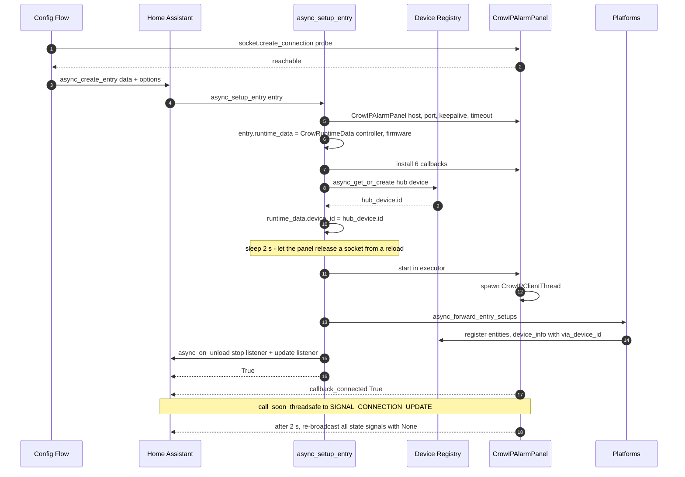

---

## 3. User command workflow

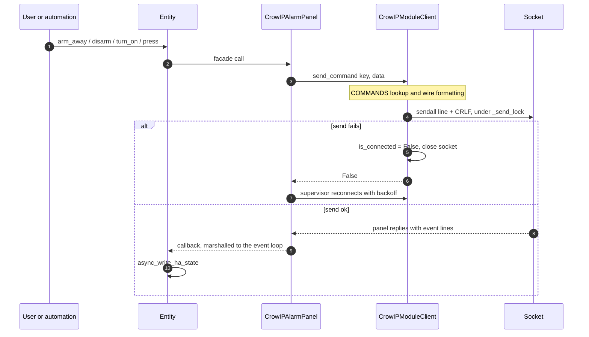

Wire formats produced by the path above:

| Action | Line on the wire |
|---|---|
| Arm away | `ARM ` |
| Arm stay | `STAY ` |
| Disarm with code `1234` | `KEYS 1234E` then `STATUS ` |
| Panic | `PANIC ` |
| Toggle output 2 | `OO2` (no space) |
| Toggle chime | `CHIME ` |
| Relay 1 | `RL1 ` |

---

## 4. Runtime data flow

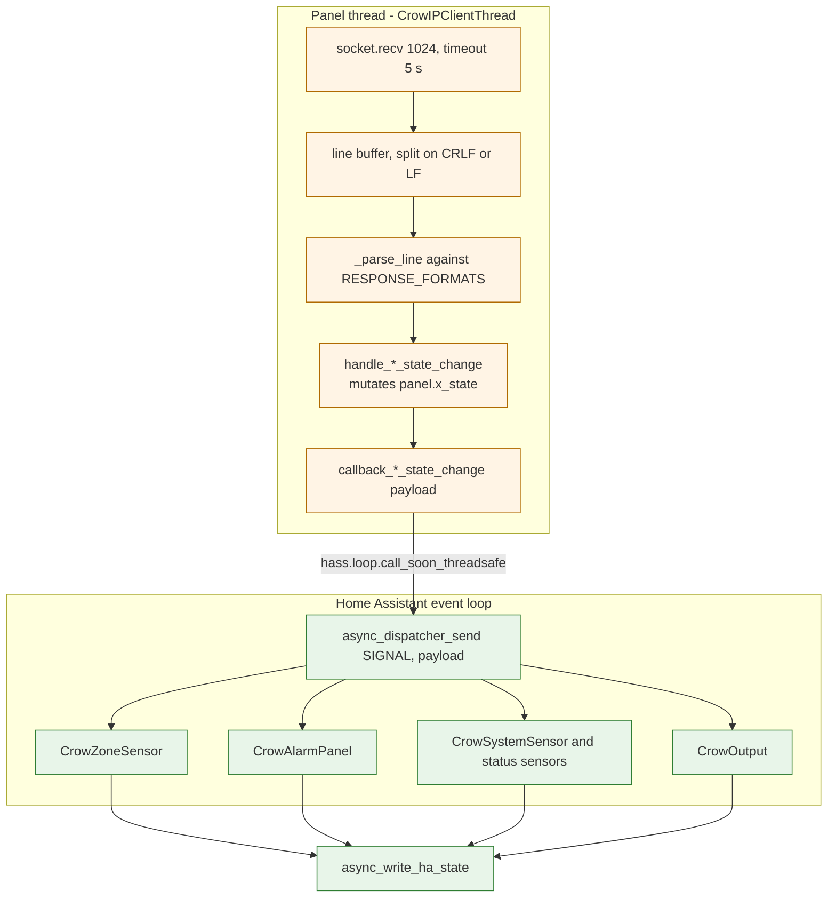

**Rules.** The panel thread never touches Home Assistant objects. Panel state dicts are written only
by the panel thread and read only by the loop. `None` as a payload means "refresh everything".

---

## 5. Connection lifecycle

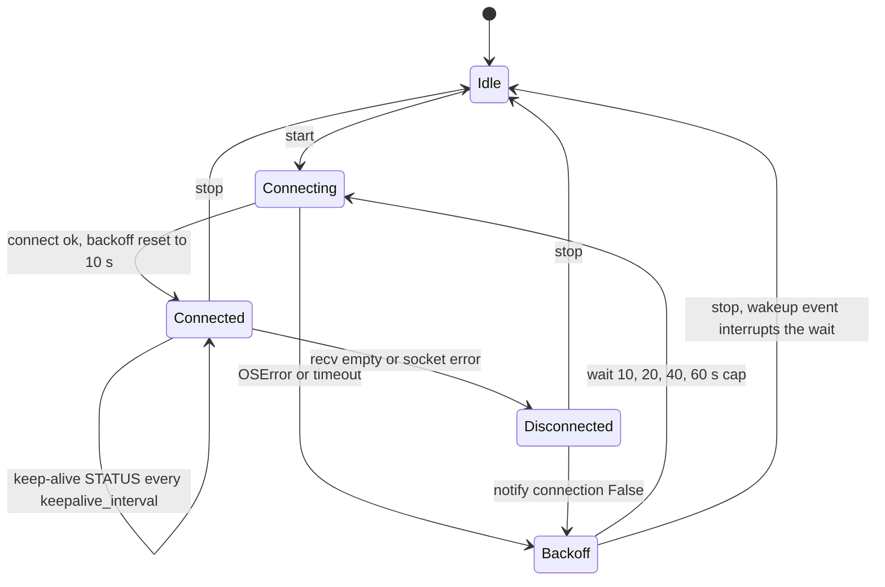

Entity availability follows the `SIGNAL_CONNECTION_UPDATE` signal:

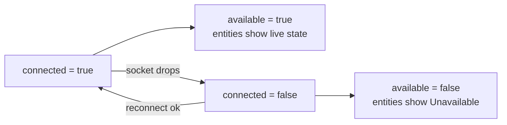

---

## 6. Configuration and options flow

**Config flow** (first-time setup, five steps):

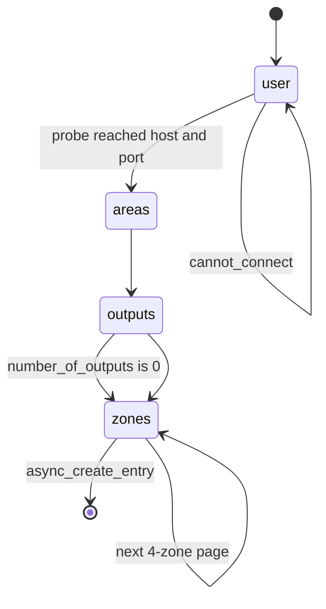

**Options flow** (re-configuration from the integration page):

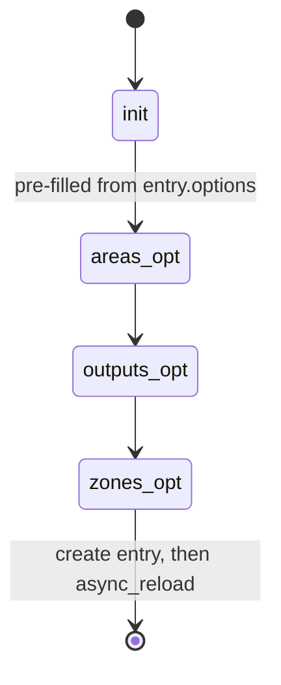

Zone pages are 4 fields wide (`PAGE_SIZE = 4`), so 16 zones produce four form pages.

---

## 7. Reload and unload

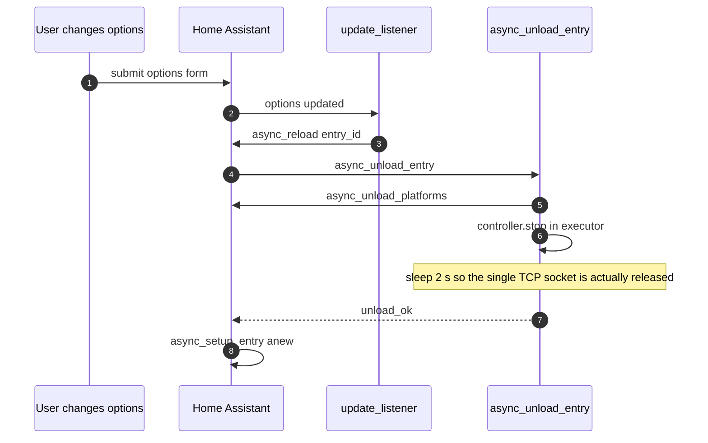

---

## 8. Verification workflow

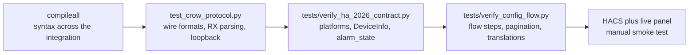

Layers A–D run without Home Assistant installed, which is required because Home Assistant 2026.9
needs Python 3.14.2+.

---

## 9. Legacy architecture — GitDiagram reference

[GitDiagram](https://gitdiagram.com) was run against
`acdcnow/Crow-AAP-Alarm-System-for-Home-Assistant`. It reported **16 components and 27 connections**.

> **Important limitation.** GitDiagram analyses the repository's **default branch only**. At the time
> of writing that is `master`, which still depends on the external `pycrowipmodule` package — the tool
> said so itself: *"the external pycrowipmodule implementation was not provided."*
> The diagram therefore describes the **legacy** architecture, not `HA2026_09_dev`.

Re-generate or explore it interactively at:
**https://gitdiagram.com/acdcnow/crow-aap-alarm-system-for-home-assistant**

The equivalent topology, transcribed from GitDiagram's component and edge list:

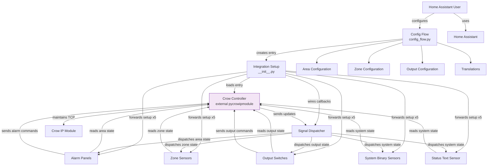

The same shape in the current (`HA2026_09_dev`) architecture, for comparison — the differences are
the local driver, the extra sensor/button platforms, `runtime_data`, the hub device and diagnostics:

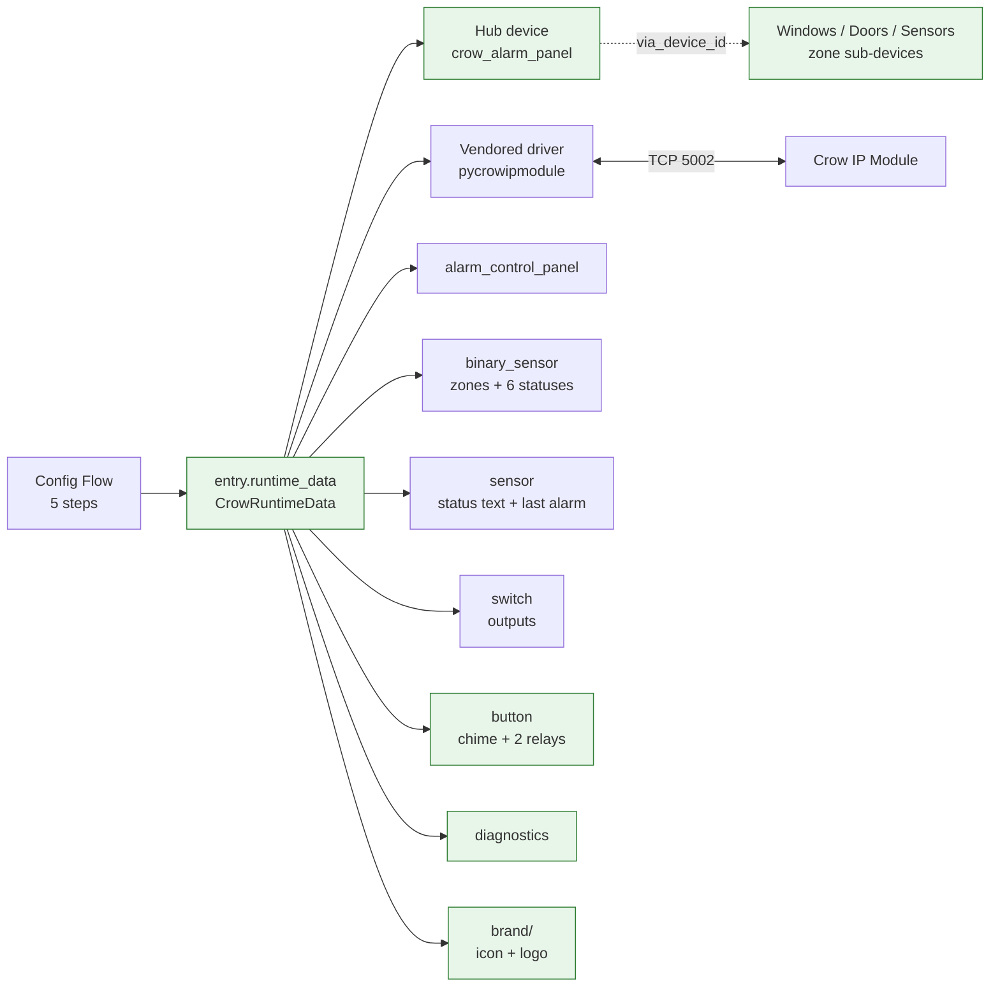

Green nodes mark what the 2026.9 development branch added or changed.

---

## 10. Release workflow

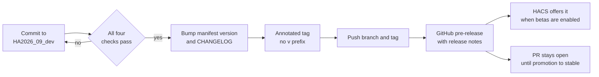
